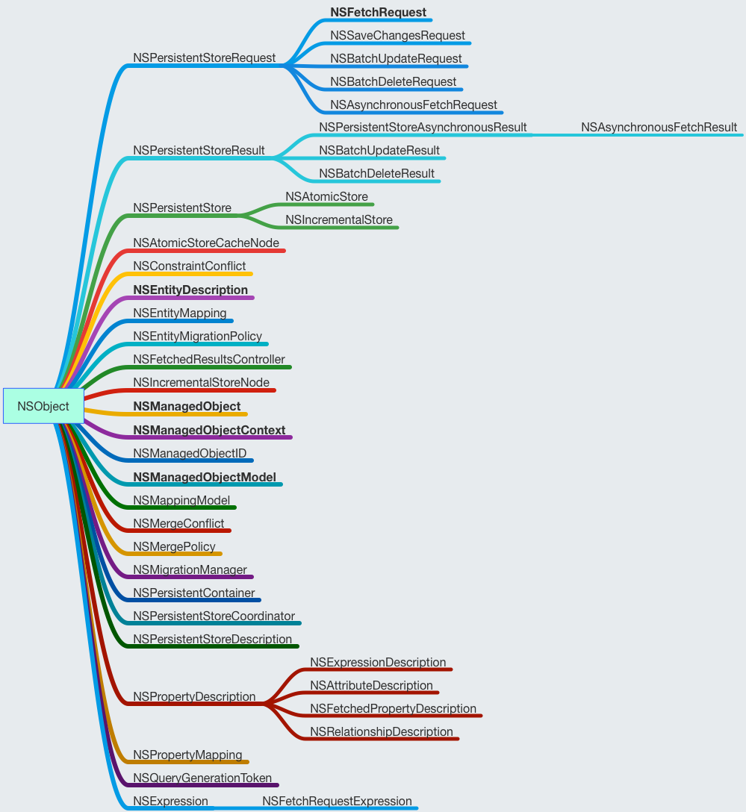
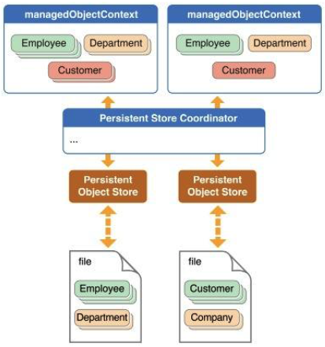

### CoreData简述
CoreData是对SQL的封装，不需要写SQL语句即可对数据进行处理，但是性能不如SQLite

### CoreData框架
CoreData的类结构如下图

### CoreData实现原理
存储数据相关的类
- NSFetchRequest
- NSEntityDescription
- NSManagedObject
- NSManagedObjectContext
- NSManagedObjectModel
- NSPersistentStoreCoordinator

数据存储原理如下图

1. NSManagedObjectModel
描述一种表结构，对应实体类

一个model包含一个或多个NSEntityDescription用来代表这个实体类
2. NSPersistentStoreCoordinator
本地存储文件和缓存层之间的一个持久化层

按照序列化操作，如果在多线程中使用不同的写操作，要使用不同的NSPersistentStoreCoordinator，如果多线程操作同一个NSPersistentStoreCoordinator，需要使用锁来保证操作的正确性
3. NSManagedObjectContext
缓存层，会把所有的操作先缓存起来避免大量磁盘IO，操作完成后调用save进行持久化

4. NSEntityDescription
用于描述实体
