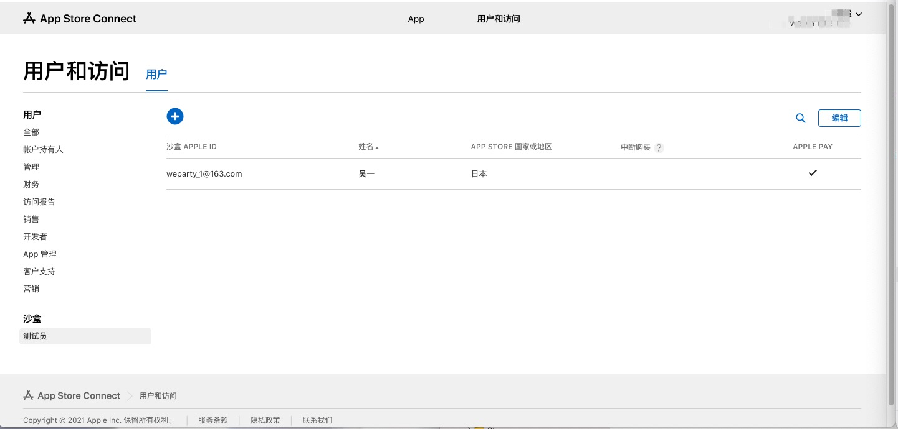
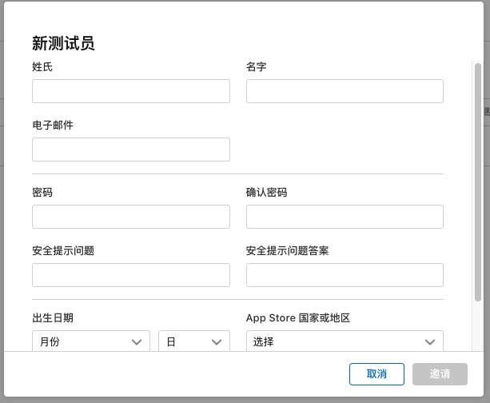

## IAP测试的注意事项

[参考链接](https://www.jianshu.com/p/1ef61a785508)

### 注意事项

- 项目的bundleID和App Store Connect的bundleID、证书的bundleID必须一致
- 内购的商品ID、价格等信息都在App Store Connect上配置到准备提交的状态，商品等待生效需要时间
- 校验用的商品ID和App Store Connect的商品ID保持一致
- 使用没有越狱的真机进行测试
- 税务协议必须填写完全，内购属于收费App，也要添加收费App的相关信息
- 准备一个或多个沙盒测试员账号，测试包只能用沙盒账号购买，不能使用真实的AppleID进行购买

### 沙盒测试员账号相关

1. 在App Store Connect的用户和访问中添加沙盒测试员

注意

- 电子邮箱不能是已经注册过AppleID的邮箱，可以是不存在的邮箱，符合格式即可
- App Store的地区要按需要进行选择，不同的地区会不一样

2. 使用沙盒测试员账号进行测试

- 测试前需要退出手机上的App Store账号，可以在App Store应用或者设置中的App Store中退出
- 保持未登录的状态，在手机上安装测试包(develop签名证书打的包)，进入应用，触发购买
- 使用现有的AppleID，输入沙盒测试员账号登陆即可购买，沙盒账号的购买是虚拟账号的购买，不用考虑充值的问题
