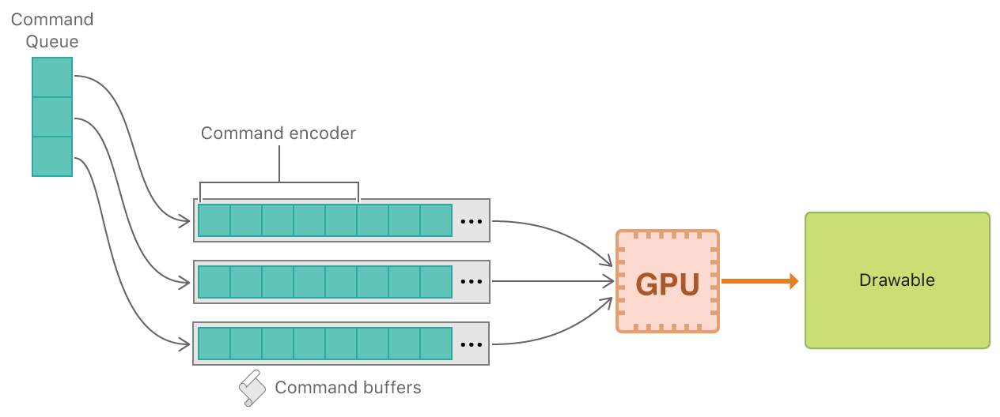

### Metal基础

## 对比OpenGL

- Metal只针对苹果，不能够跨平台，但是OpenGL ES可以跨平台
- Metal能够最大化使用GPU能力，但是OpenGL不可以

## 苹果软硬件渲染架构

UIKit -> Core Graphics -> Metal/OpenGL ES -> GPU Driver -> GPU

## 特点

- GPU支持3D渲染
- 与CPU并行处理数据
- 提供低功耗接口
- 与CPU共享资源内存

## metal组成

- Metal framework
- MetalKit framework
- Metal shading language
- Metal standard library

## metal相关组件与命令

### MTKViewDelegate

通过MTKViewDelegate实现mtkView: drawableSizeWillChange: 和drawInMTKView: 方法

- mtkView: drawableSizeWillChange: 在重新布局view时会调用，用于更新view大小和分辨率
- drawInMTKView: 每一帧都会调用，用于渲染新一帧的图像，由view的preferredFramesPerSecond属性设置帧速率

### Metal Command相关

#### MTLDevice

MTLDevice对象表示GPU，一般通过MTLCreateSystemDefaultDevice()方法获取设备默认GPU的MTLDevice对象
MTLDevice可以提供GPU的信息，但主要目的是用于创建可以和GPU交互的对象

#### MTLCommandQueue

用于创建和组织MTLCommandBuffer对象，确保正确的顺序发送数据

```
_commandQueue = [_device newCommandQueue];
```

#### MTLCommandEncoder

使用不同的MTLCommandEncoder类执行不同类型的任务

##### MTLRenderCommandEncoder

用于将像素渲染到MetalKit view的drawable

首先要创建MTLRenderPassDescriptor对象

MTLRenderPassDescriptor是一个轻量级临时对象，包含一些配置属性，MTLCommandBuffer使用MTLRenderPassDescriptor创建一个MTLRenderCommandEncoder，之后就不需要再使用MTLRenderPassDescriptor对象

Metal view在每一帧创建一个新的MTLRenderPassDescriptor对象，通过currentRenderPassDescriptor提供

编码完数据后，调用endEncoding方法指示编码完成

##### MTLParallerRenderCommandEncoder

使用多个线程进行多个渲染通道的编码工作，该对象管理共享相同命令缓冲区和渲染传递描述符的多个从属MTLRenderCommandEncoder。使用此体系结构，可以以安全且高性能的方式并行地将每个MTLRenderCommandEncoder分配给线程

```
if let parallelRenderEncoder = commandBuffer?.makeParallelRenderCommandEncoder(descriptor: renderPassDescriptor) {
    var ncpu: UInt = 0
    var len = MemoryLayout.size(ofValue: ncpu)
    sysctlbyname("hw.ncpu", &ncpu, &len, nil, 0)
    for _ in 1...(ncpu - 1) {
        if let renderEncoder = parallelRenderEncoder.makeRenderCommandEncoder() {

            renderEncoder.endEncoding()
        }
    }
    parallelRenderEncoder.endEncoding()
}
```

#### 编码结束后

使用commandBuffer的presentDrawable方法让Metal在屏幕上显示之前等待GPU完成渲染到drawable

使用commandBuffer的commit方法执行对encoder或commandbuffer的调用，metal会调用commandBuffer，让GPU使用新颜色清除drawable，执行完成后渲染drawable到屏幕上

#### 命令对象之间的关系

1. command buffers是从command queue创建的
2. command encoders将命令编码到命令缓冲区中
3. 提交命令并发送到GPU
4. GPU执行命令并绘制到drawable


