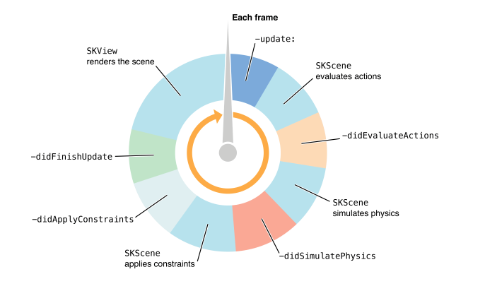
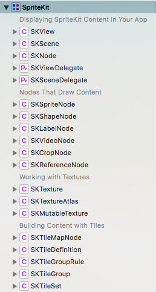
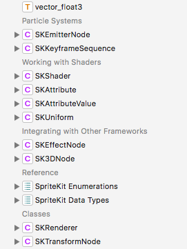

### SpriteKit
SpriteKit框架使用优化的动画系统、物理模拟和事件处理支持创建基于2D精灵的游戏

### SpriteKit概述

SpriteKit提供了一个图形渲染和动画的基础结构，你可以使用它让任意类型的纹理图片或者精灵动起来。SpriteKit使用传统的渲染循环，在每一帧被渲染之前帧的内容就已经处理好了。你的游戏决定了场景的内容以及场景中的每一帧是如何变化的。SpriteKit利用图形硬件高效的渲染动画的每一帧。SpriteKit是经过高度优化的，所以精灵的位置可以在每帧动画中任意的改变。

SpriteKit渲染的原理图如下

SpriteKit是一个图形渲染和动画基础架构，您可以使用它来动画任意纹理图像，否则称为sprites。 SpriteKit提供了一个传统的渲染循环，在确定渲染帧和渲染帧之间交替进行。 您确定帧的内容以及这些内容如何更改。 SpriteKit完成了使用图形硬件高效渲染该帧的工作。 SpriteKit针对任意动画或内容更改进行了优化。 这种设计使SpriteKit更适合需要灵活处理动画的游戏和应用程序。

#### 渲染过程
动画和渲染由<font color="red">SKView</font>对象执行。 你把这个<font color="red">SKView</font>放到一个<font color="red">UIWindow</font>中，然后把内容呈现给它。 因为它是一个视图View，其内容可以与视图层次结构中的其他视图组合。

游戏中的内容被组织成<font color="red">SKScene</font>对象。 一个场景持有精灵<font color="red">sprites</font>和其他内容被渲染。 场景还实现了每帧逻辑和内容处理。 在任何时候，视图呈现一个<font color="red">SKScene</font>。 只要场景呈现，其动画和每帧逻辑就会自动执行。

要使用SpriteKit创建游戏或应用程序，您要么<font color="red">SKScene</font>类的子类，要么创建一个场景<font color="red">scene</font>代理来执行主要的游戏相关任务。 例如，您可以创建单独的场景类来显示主菜单，游戏画面和游戏结束后显示的内容。 您可以在UIWindow中轻松使用单个SKView对象，并在不同的场景之间切换。 切换场景时，可以使用<font color="red">SKTransition</font>类在两个场景之间进行动画处理。

#### SKNode
<font color="red">SKNode</font>是所有内容的基本构建块，<font color="red">SKScene</font>充当树的根节点，决定哪些内容被绘制以及如何绘制。

每个SKNode的位置由父节点的坐标系指定。子节点会跟随父节点进行变化，如旋转、缩放、混合等操作。

SKNode不会进行绘制，只传递属性。SpriteKit中的绘制部分由不同的子类表示，其中一部分SKNode不会绘制内容，只修改子节点的行为。例如，<font color="red">SKEffectNode</font>对象会将<font color="red">Core Image filter</font>应用于整个子树。节点数的结构可以确定节点的渲染顺序。

所有的SKNode都继承自UIResponder，可以接收用户输入。

#### SKTexture
<font color="red">SKTexture</font>对象用于表示渲染精灵的纹理。通常通过加载存储在应用程序中的图像文件来创建纹理。也可以通过Core Graphics图像等其他方式创建纹理。

<font color="red">SpriteKit</font>通过处理加载纹理所需的底层代码并使用图形硬件来简化纹理管理。

纹理图集<font color="red">SKTextureAtlas</font>是与游戏一同使用的一组相关纹理，SpriteKit会使用纹理图集来提高渲染性能

#### SKAction
<font color="red">SKScene</font>中的内容使用<font color="red">SKAction</font>进行动画。当场景处理动画帧时，会执行SKAction。动作最常见的用途是动画改变节点的属性，如移动、缩放、旋转等。也可用于改变节点树，播放声音，执行自定义代码等。

<font color="red">SKAction</font>支持同时运行的操作组，也支持按顺序运行的操作序列，也可以使其自动重复。

#### 物理相关
创建<font color="red">SKPhysicsBody</font>并将其附加到<font color="red">SKNode</font>上，每个物理体都由形状、大小、质量和其他物理特征来定义。

当场景中包含物理实体时，场景在模拟这些实体物体时，会自动应用摩擦、重力等。通过添加SKFieldNode对象到场景中，可以用于构建力场，作用于多个物理体。

在碰撞发生时可以在回调中添加游戏逻辑，例如，在物理体发生碰撞时破坏一个节点等。

还可以使用SKPhysicsJoint将物理体连接在一起，会根据关节的类型一起模拟。

---

### SpriteKit详述

#### 节点树
<font color="red">SpriteKit</font>将内容表示为节点树。节点树由SKScene作为根节点，其他内容作为子节点。场景的每一帧都被处理并呈现为一个视图。

<font color="red">SpriteKit</font>的主要类
- SKView
- SKScene
- SKNode
- SKSpriteNode
- SKAction
- SKPhysicsBody

#### 创建游戏界面
SpriteKit的内容被放置在SKView中进行显示。SKView呈现的内容由SKScene提供。SKScene参与响应者链，并具有其他功能。
```
// Load the SKScene from 'GameScene.sks'
GameScene *scene = (GameScene *)[SKScene nodeWithFileNamed:@"GameScene"];
SKView *skView = (SKView *)self.view;
// Present the scene
[skView presentScene:scene];
```
调用presentScene时会调用SKScene的didMoveToView方法，可以重写didMoveToView方法添加SKNode
```
SKLabelNode *labelNode = SKLabelNode.new;
[self addChild:labelNode];
```
#### 框架结构
框架结构图如下




1. 创建用于表示和显示内容的基本对象SpriteKit
- SKView
  - 显示SpriteKit内容的对象。这个内容由SKScene提供
- SKScene
  - 显示在视图中的所有SpriteKit对象的根节点
- SKNode
  - SKNode类是大多数SpriteKit内容的基本构建块
- SKViewDelegate
  - 允许动态控制SKView对象的渲染速率的代理
- SKSceneDelegate
  - SKScene Loop中的代理
2. 绘制内容的节点
生成可以显示形状、纹理、图像和视频的可视化节点
- SKSpriteNode
  - 绘制矩形纹理、图像或颜色的节点
- SKShapeNode
  - 呈现有Core Graphics路径定义形状的节点
- SKLabelNode
  - 显示文本的节点
- SKVideoNode
  - 显示视频内容的节点
- SKCropNode
  - 用于裁剪节点使得节点只有一部分绘制到帧缓冲区
- SKReferenceNode
  - 用于复用SKNode和SKAction
3. 纹理
- SKTexture
  - 用于设置纹理
- SKTextureAtlas
  - 一组纹理
- SKMutableTexture
  - 可以动态更新的纹理
4. 瓦片
瓦片可以支持更好的管理长方形、六边形等规则图像组成的网格地图
- SKTileMapNode
  - 用于渲染纹理二维数组的节点
- SKTileDefinition
  - 瓦片地图中使用的单一类型瓦片的信息
- SKTileGroupRule
  - 瓦片的拼接规则
- SKTileGroup
  - 一组瓦片
- SKTileSet
  - 瓦片类型定义的类
5. 动画
动画效果
- SKAction
  - SKNode用于改变结构或内容时执行的对象
- SKTransition
  - 用于执行两个SKScene之间的动画过渡
6. 约束
- SKConstraint
  - 限制节点位置或旋转的约束
- SKRange
  - 定义
- SKReachConstraints
  - 反向动力学相关的约束
7. 扭曲节点
- SKWarpGeometry
  - SKWarp相关的基础定义
- SKWarpGeometryGrid
  - 基于网格的节点变形
- SKWarpable
  - 变形和动画相关的协议
8. 摄像机和照明
- SKCameraNode
  - 控制摄像机移动、缩放、旋转的节点
- SKLightNode
  - 控制照明的节点
9. 音频播放
- SKAudioNode
  - 位置音频
10. 物理相关
- SKPhysicsWorld
  - 模拟物理场景的对象
- SKPhysicsBody
  - 将物理模拟添加到节点的对象
- SKPhysicsContact
  - 描述两个物理体之间的联系
- SKPhysicsContactDelegate
  - SKPhysicsContact相关代理
- SKPhysicsJoint
  - 连接物理体对象的基类
- SKPhysicsJointFixed
  - 物理体连接的节点
- SKPhysicsJointLimit
  - 物理体之间的最大距离连接
- SKPhysicsJointPin
  - 支持旋转的连接
- SKPhysicsJointSliding
  - 允许两个物理体沿一个轴滑动
- SKPhysicsJointSpring
  - 允许两个物理体使用弹簧进行联合
- SKFieldNode
  - 力场的定义
- SKRegion
  - 区域的定义
- vector_float3
  - 向量类型
11. 粒子
- SKEmitterNode
  - 创建和渲染粒子
- SKKeyframeSequence
  - 关键帧
12. 着色相关
- SKShader
  - 允许使用OpenGL ES着色器来渲染或过滤节点的对象
- SKAttribute
  - 着色器的每个节点数据的规范
- SKAttributeValue
  - SKAttribute相关的数据
- SKUniform
  - 统一的着色器数据
13. 其他
- SKEffectNode
  - 可以将Core Image filters或SKWarpGeometry失真应用于其子项的节点
- SK3DNode
  - 将SceneKit场景呈现为2D图像的节点
- SKRenderer
- SKTransformNode
